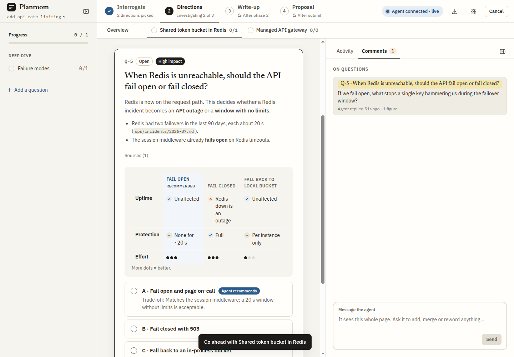
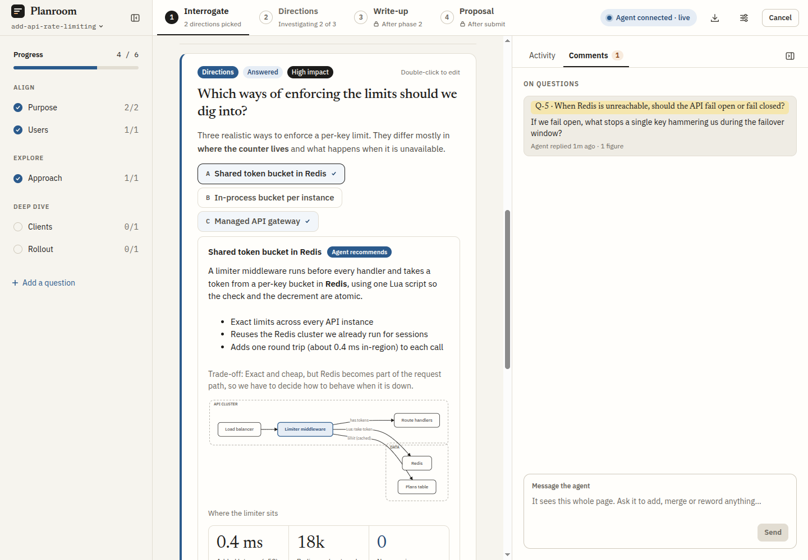
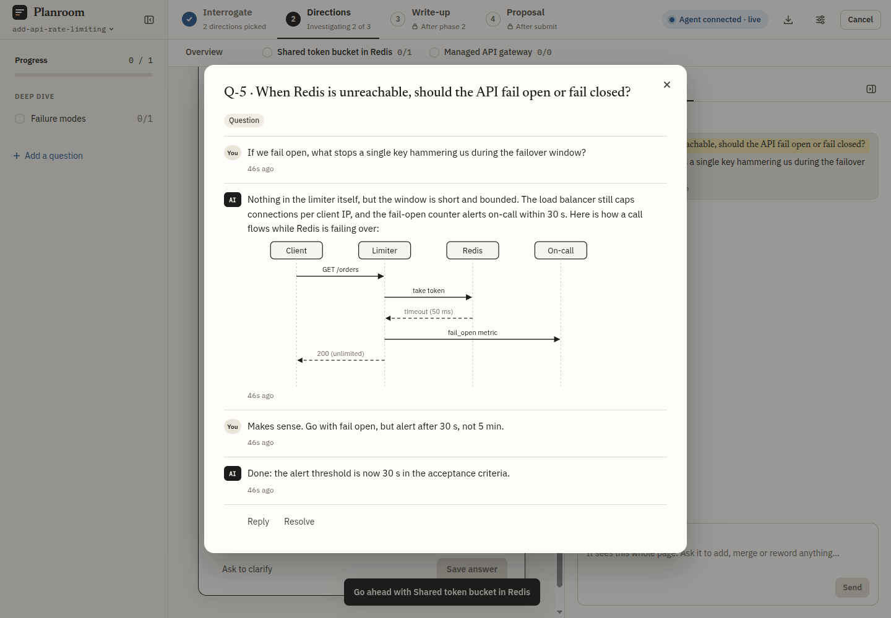
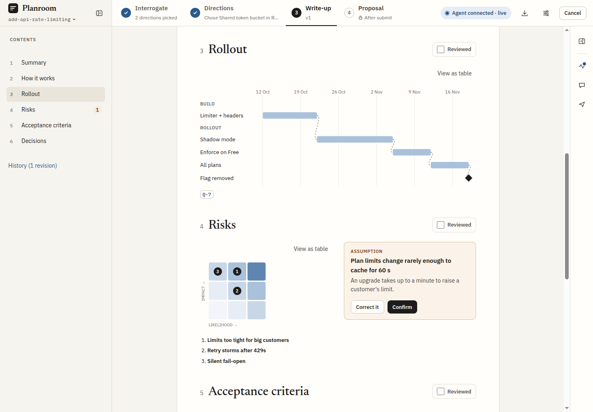

# Planroom

A live browser planning page for Claude Code. Claude grills you through question cards, turns the answers into a
visual write-up, and proposes the result as a strictly validated OpenSpec change or a Markdown plan.

Claude can also put any series of questions on a simpler page of question cards, in any repo and outside a plan, and
take the answers back as context, and walk you through someone else's pull request before you review it.

One package holds the `planroom` command, the page, three MCP servers with a skill each (`planroom` for planning,
`planroom-ask` for questions, `planroom-review` for reviews) and four subagents.

## Why Planroom

Planning a change in a terminal chat is a wall of text: the agent writes a long plan, you scroll it, then accept it or
write a long reply. Planroom turns that into a working session with Claude, closer to planning at a whiteboard with
another developer than to reviewing a document.

**You stay in the loop.** Claude asks one decision at a time on question cards, each with what it already found in the
code and the option it would pick. You answer, correct its assumptions or comment on any line, and it reacts while you
are still on the page. It shows what it is working on, so you never wonder whether it is stuck.



**It explains with pictures.** When a choice turns on a flow or a trade-off, Claude draws it: architecture and sequence
diagrams, option matrices, Gantt charts and risk matrices, among 26 block types. A hard idea lands faster as a diagram
than as three paragraphs.

**It makes you look wide before you go deep.** A plan starts by agreeing the goals and confirming what Claude is
assuming. Then it lays out the different ways to make the change side by side, each with its own diagrams and
trade-offs, and you pick which to investigate before any of them gets detailed. Failure modes, rollout and impact are
asked as explicit decisions, and every assumption that reaches the write-up waits for you to confirm it.



**It is a conversation.** Select any text and ask about it, the way you would lean over to a colleague: "what stops a
single key hammering us?" Claude answers in the thread, with a diagram when that says it better, and edits the plan
when you agree. It feels like pair programming on the design.



**It costs fewer tokens and less waiting than having Claude write HTML.** Claude never writes markup. It sends small
typed events, such as a diagram as its nodes and edges, and the page lays them out and draws them. A change updates one
card or block rather than regenerating a page, and your answers come back as short structured events rather than a
page to read again. Less output means less to pay for and less time watching it stream.

The answers become a write-up you review section by section, then a validated OpenSpec change or Markdown plan.



## Install

Needs Node 24 or newer and Claude Code.

```sh
npm i -g @moses-wescombe/planroom
planroom install
```

`planroom install` links the `planroom`, `planroom-ask` and `planroom-review` skills and the agents into `~/.claude` (or
`$CLAUDE_CONFIG_DIR`) and registers user-scope `planroom`, `planroom-ask` and `planroom-review` MCP servers.
OpenSpec-format plans also need the OpenSpec CLI, pinned in the repo or from `npm i -g @fission-ai/openspec`.

Upgrade with `npm i -g @moses-wescombe/planroom@latest`, then reconnect `planroom`, `planroom-ask` and `planroom-review`
in `/mcp` in any running session. The skills and agents are links into the package, so they upgrade with it. Run `planroom install`
again after switching your default Node version, since it records absolute paths, and once after upgrading from 1.0,
whose skill link points at a folder that has moved and which had no `planroom-ask`.

To turn planning, asking or reviewing off, disable its server in `/mcp` and its skill in `/skills`. Turn off both, or Claude may
reach for tools that are gone, or skip the guidance for the ones that are left.

## Use

In Claude Code, ask it to plan something ("plan adding rate limiting") in a repo with an `openspec/` directory. Once
it has more than one question for you mid-task, in any repo, it puts them on a page of question cards instead of in
chat.

Claude polls the page for you: it calls `planroom_wait`, which returns as soon as you act on the page, or after 10
minutes with nothing. Each return is a model turn, so a session left open on an idle page still spends tokens, about
one turn every 10 minutes. Accept the plan or end the session to stop it.

Channels are optional. Launch Claude Code with
`claude --dangerously-load-development-channels server:planroom server:planroom-ask server:planroom-review` and what you do on the page also
reaches Claude while it is busy rather than waiting. Without them, those events wait for
its next poll. Channels are a research preview; on claude.ai Team and Enterprise an Owner must allow them.

| Command                               | Does                                                                     |
| ------------------------------------- | ------------------------------------------------------------------------ |
| `planroom open [change-id]`           | Open this repo's plans read-only in the browser, or one plan             |
| `planroom list`                       | List the plans in every repo Planroom has run in                         |
| `planroom install` / `uninstall`      | Wire Planroom into Claude Code, or remove it                             |
| `planroom mcp [--ask\|--review] [--dir <path>]` | An MCP server Claude Code starts, `--ask` for questions, `--review` for reviews; not run by hand |

## Planroom Review

Ask Claude to review a pull request ("review PR 412", or its link) or a local branch ("walk me through feature/retry")
from a checkout of the repo. It reads the change from a temporary git worktree at the PR's head, under
`.planroom/reviews/<id>/worktree`, so your working copy is never touched, and removes it when the review ends.

1. **Walkthrough.** Claude builds a deck of 6 to 15 slides in four chapters (Why, How it works, What it might impact,
   Trade-offs) from diagrams, step-throughs, analogies and pictures it draws as SVG itself. You see its progress while
   it builds, then the deck up to What it might impact at once. Move with the arrow keys, the chapter bar or the
   overview. Your-take cards ask for your prediction, pros and cons, risk ratings or an answer before they show
   Claude's view. What it might impact maps the areas the change might reach: open one to see how, and write your
   questions and concerns under it, or add an area Claude missed. Moving on sends them to Claude, which investigates
   them and writes Trade-offs, answering each of your concerns beside its own.
2. **Review.** Reviewer subagents, then a verify pass that drops what it cannot confirm. Claude starts none until you
   start the review from the page as it opens, choosing the strength (one reviewer that checks itself, one reviewer and
   a verifier, or one per dimension and a verifier) and the agents' model and effort. The findings stay hidden until
   you finish the walkthrough or skip to them. Agree, reword or reject each one, or argue in its thread first. They
   show as cards, beside their lines in the diff, as pins on the deck's diagrams, as charts, a file heat map and a risk
   matrix.
3. **Comments.** Every comment as Bitbucket will show it. Text Claude drafted ends with "- Claude" until more than half
   of it is your own words. Post creates them as Bitbucket drafts, the summary last, with a task on each you toggle; you
   finish the review in Bitbucket. Post checks the PR has not moved under your comments first, and a retry sends only
   what failed. A local branch copies the comments as Markdown instead and makes no network call.

When the author pushes and you ask for the review again, a new round covers only what changed, labels your earlier
comments addressed, partly, not addressed or outdated, shows the author's replies, and drafts follow-ups. Earlier rounds
stay readable.

**Bitbucket access.** Set `BITBUCKET_API_TOKEN` to a Bitbucket Cloud API token (Atlassian account settings, Security,
API tokens) with the scope `read:pullrequest:bitbucket`, and `read:repository:bitbucket` if reading the PR is refused,
in the environment Claude Code starts in. It signs in with your `git config user.email`, which must be the token's
Atlassian account. Only the Planroom server reads them: they never reach the page, Claude, a log or a file. Without
them a public PR still opens, and Post stays off saying what to set.

**Preferences.** Settings has a Review section: which your-take cards Claude uses and how many, the reviewer agents
each review offers to start, and which views of the findings show. They are saved for every review in
`$XDG_CONFIG_HOME/planroom/review.json` (by default `~/.config/planroom/review.json`).

Export saves the walkthrough as a PDF, one slide to a page, or as one HTML file with the pictures inlined.

## Develop

```sh
pnpm install
pnpm build
npm link             # the global `planroom` now runs this checkout
planroom install     # links ~/.claude at this checkout's skills/ and agents/
```

Rebuild, then reconnect `planroom`, `planroom-ask` and `planroom-review` in `/mcp` to pick up changes. See `AGENTS.md` for the rules and checks.

## Release

Bump `version` in `package.json`, commit, and push a matching `v<version>` tag. CI checks, builds and publishes it.
